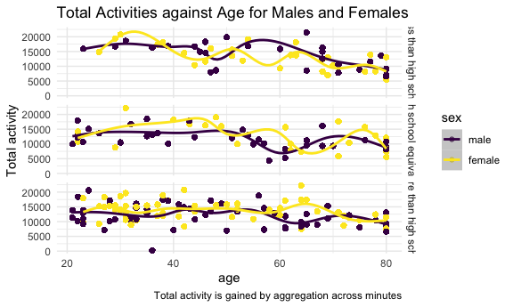
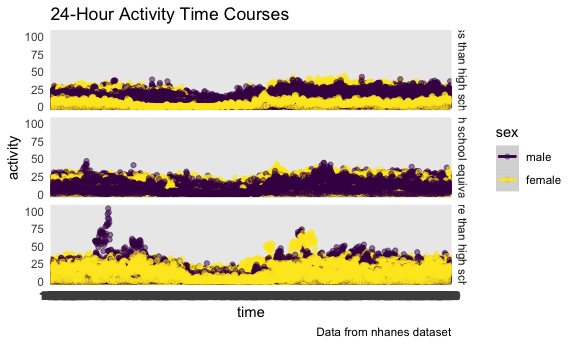

p8105_hw3_ml5018
================
Luan Mengxiao
2023-10-05

This is a R Markdown document for homework 3.

Load the package to be used for problem solving.

``` r
library(tidyverse)

options(tibble.print_min = 5)

knitr::opts_chunk$set(
  fig.width = 6,
  fig.asp = .6,
  out.width = "90%"
)

theme_set(theme_minimal() + theme(legend.position = "right"))

options(
  ggplot2.continuous.colour = "viridis",
  ggplot2.continuous.fill = "viridis"
)

scale_colour_discrete = scale_colour_viridis_d
scale_fill_discrete = scale_fill_viridis_d
```

# Problem 1

## load the data

This problem uses the Instacart data. Load the data from the
`p8105.datasets` using the following code chunk.

``` r
library(p8105.datasets)
data("instacart")
```

## describe the data

The goal is to do some exploration of this dataset. To that end, write a
short description of the dataset, noting the size and structure of the
data, describing some key variables, and giving illustrative examples of
observations.

While the original data is quite extensive, the dataset loaded from
`p8105.datasets` represents a cleaned and limited version. The dataset
contains 1,384,617 observations of 131,209 unique users, where each row
in the dataset is a product from an order. There is a single order per
user in this dataset.

The dataset consists of 1384617 observations of 15 variables, which form
a total of 20769255 data points. The dataset is organized in a longer
form that makes it tidy and easy for computation using codes.

Some of the key vaiables of the dataset include order_id, product_id,
add_to_cart_order, reordered, user_id, eval_set, order_number,
order_dow, order_hour_of_day, days_since_prior_order, product_name,
aisle_id, department_id, aisle, department.

The 15 variables contain information about the order, product and
customer, as listed in details below:

- order_id: order identifier
- product_id: product identifier
- add_to_cart_order: order in which each product was added to cart
- reordered: 1 if this prodcut has been ordered by this user in the
  past, 0 otherwise
- user_id: customer identifier
- eval_set: which evaluation set this order belongs in (Note that the
  data for use in this class is exclusively from the “train” eval_set)
- order_number: the order sequence number for this user (1=first, n=nth)
- order_dow: the day of the week on which the order was placed
- order_hour_of_day: the hour of the day on which the order was placed
- days_since_prior_order: days since the last order, capped at 30, NA if
  order_number=1
- product_name: name of the product
- aisle_id: aisle identifier
- department_id: department identifier
- aisle: the name of the aisle
- department: the name of the department

And some of the key characteristics of these variables are summarized
below.

``` r
skimr::skim(instacart)
```

|                                                  |           |
|:-------------------------------------------------|:----------|
| Name                                             | instacart |
| Number of rows                                   | 1384617   |
| Number of columns                                | 15        |
| \_\_\_\_\_\_\_\_\_\_\_\_\_\_\_\_\_\_\_\_\_\_\_   |           |
| Column type frequency:                           |           |
| character                                        | 4         |
| numeric                                          | 11        |
| \_\_\_\_\_\_\_\_\_\_\_\_\_\_\_\_\_\_\_\_\_\_\_\_ |           |
| Group variables                                  | None      |

Data summary

**Variable type: character**

| skim_variable | n_missing | complete_rate | min | max | empty | n_unique | whitespace |
|:--------------|----------:|--------------:|----:|----:|------:|---------:|-----------:|
| eval_set      |         0 |             1 |   5 |   5 |     0 |        1 |          0 |
| product_name  |         0 |             1 |   3 | 159 |     0 |    39123 |          0 |
| aisle         |         0 |             1 |   3 |  29 |     0 |      134 |          0 |
| department    |         0 |             1 |   4 |  15 |     0 |       21 |          0 |

**Variable type: numeric**

| skim_variable          | n_missing | complete_rate |       mean |        sd |  p0 |    p25 |     p50 |     p75 |    p100 | hist  |
|:-----------------------|----------:|--------------:|-----------:|----------:|----:|-------:|--------:|--------:|--------:|:------|
| order_id               |         0 |             1 | 1706297.62 | 989732.65 |   1 | 843370 | 1701880 | 2568023 | 3421070 | ▇▇▇▇▇ |
| product_id             |         0 |             1 |   25556.24 |  14121.27 |   1 |  13380 |   25298 |   37940 |   49688 | ▆▆▇▆▇ |
| add_to_cart_order      |         0 |             1 |       8.76 |      7.42 |   1 |      3 |       7 |      12 |      80 | ▇▁▁▁▁ |
| reordered              |         0 |             1 |       0.60 |      0.49 |   0 |      0 |       1 |       1 |       1 | ▆▁▁▁▇ |
| user_id                |         0 |             1 |  103112.78 |  59487.15 |   1 |  51732 |  102933 |  154959 |  206209 | ▇▇▇▇▇ |
| order_number           |         0 |             1 |      17.09 |     16.61 |   4 |      6 |      11 |      21 |     100 | ▇▂▁▁▁ |
| order_dow              |         0 |             1 |       2.70 |      2.17 |   0 |      1 |       3 |       5 |       6 | ▇▂▂▂▆ |
| order_hour_of_day      |         0 |             1 |      13.58 |      4.24 |   0 |     10 |      14 |      17 |      23 | ▁▃▇▇▃ |
| days_since_prior_order |         0 |             1 |      17.07 |     10.43 |   0 |      7 |      15 |      30 |      30 | ▅▅▃▂▇ |
| aisle_id               |         0 |             1 |      71.30 |     38.10 |   1 |     31 |      83 |     107 |     134 | ▆▃▃▇▆ |
| department_id          |         0 |             1 |       9.84 |      6.29 |   1 |      4 |       8 |      16 |      21 | ▇▂▂▅▂ |

The code chunk below gives out a few illustrative examples of
observations.

``` r
print(instacart, width = Inf)
```

    ## # A tibble: 1,384,617 × 15
    ##   order_id product_id add_to_cart_order reordered user_id eval_set order_number
    ##      <int>      <int>             <int>     <int>   <int> <chr>           <int>
    ## 1        1      49302                 1         1  112108 train               4
    ## 2        1      11109                 2         1  112108 train               4
    ## 3        1      10246                 3         0  112108 train               4
    ## 4        1      49683                 4         0  112108 train               4
    ## 5        1      43633                 5         1  112108 train               4
    ##   order_dow order_hour_of_day days_since_prior_order
    ##       <int>             <int>                  <int>
    ## 1         4                10                      9
    ## 2         4                10                      9
    ## 3         4                10                      9
    ## 4         4                10                      9
    ## 5         4                10                      9
    ##   product_name                                  aisle_id department_id
    ##   <chr>                                            <int>         <int>
    ## 1 Bulgarian Yogurt                                   120            16
    ## 2 Organic 4% Milk Fat Whole Milk Cottage Cheese      108            16
    ## 3 Organic Celery Hearts                               83             4
    ## 4 Cucumber Kirby                                      83             4
    ## 5 Lightly Smoked Sardines in Olive Oil                95            15
    ##   aisle                department  
    ##   <chr>                <chr>       
    ## 1 yogurt               dairy eggs  
    ## 2 other creams cheeses dairy eggs  
    ## 3 fresh vegetables     produce     
    ## 4 fresh vegetables     produce     
    ## 5 canned meat seafood  canned goods
    ## # ℹ 1,384,612 more rows

Then, do or answer the following (commenting on the results of each):

How many aisles are there, and which aisles are the most items ordered
from?

``` r
instacart |>
  group_by(aisle_id, aisle) |>
  summarize(n_obs = n()) |>
  arrange(desc(n_obs))
```

    ## `summarise()` has grouped output by 'aisle_id'. You can override using the
    ## `.groups` argument.

    ## # A tibble: 134 × 3
    ## # Groups:   aisle_id [134]
    ##   aisle_id aisle                       n_obs
    ##      <int> <chr>                       <int>
    ## 1       83 fresh vegetables           150609
    ## 2       24 fresh fruits               150473
    ## 3      123 packaged vegetables fruits  78493
    ## 4      120 yogurt                      55240
    ## 5       21 packaged cheese             41699
    ## # ℹ 129 more rows

There are 134 aisles in total, among which the most items come from
`fresh vegetables` and `fresh fruits`, with little difference between
the amounts of these two aisles.

Make a plot that shows the number of items ordered in each aisle,
limiting this to aisles with more than 10000 items ordered. Arrange
aisles sensibly, and organize your plot so others can read it.

``` r
instacart |>
  group_by(aisle) |>
  summarize(n_obs = n()) |>
  filter(n_obs > 10000) |>
  ggplot(aes(x = aisle, y = n_obs)) +
  geom_col(fill = "blue") +
  coord_flip() +
  labs(
    title = "Number of Items Ordered at Each Aisle",
    x = "Aisle name",
    y = "Number of items ordered",
    caption = "Note: limited to aisles with more than 10000 items ordered"
  )
```


A column plot is used to visualize the data we get. To show aisle names
clearly without overlapping, the x and y axis need to be flipped.

It can be seen from the plot that “fresh vegetables” and “fresh fruits”
possess the most itmes ordered, which verifies the result we get in the
lase part.

Make a table showing the three most popular items in each of the aisles
“baking ingredients”, “dog food care”, and “packaged vegetables fruits”.
Include the number of times each item is ordered in your table.

``` r
get_table_aisle = function(aisle_name){
  result = 
    instacart |>
    filter(aisle == aisle_name) |>
    group_by(product_name, product_id) |>
    summarize(n_obs = n()) |>
    arrange(desc(n_obs)) |>
    mutate(aisle = aisle_name) |>
    select(aisle, everything())
  return(result[1:3, ])
}

table_popular = 
  bind_rows(
    get_table_aisle("baking ingredients"), 
    get_table_aisle("dog food care"), 
    get_table_aisle("packaged vegetables fruits")
    )
```

    ## `summarise()` has grouped output by 'product_name'. You can override using the
    ## `.groups` argument.
    ## `summarise()` has grouped output by 'product_name'. You can override using the
    ## `.groups` argument.
    ## `summarise()` has grouped output by 'product_name'. You can override using the
    ## `.groups` argument.

``` r
table_popular |>
  knitr::kable()
```

| aisle                      | product_name                                  | product_id | n_obs |
|:---------------------------|:----------------------------------------------|-----------:|------:|
| baking ingredients         | Light Brown Sugar                             |      23537 |   499 |
| baking ingredients         | Pure Baking Soda                              |      23405 |   387 |
| baking ingredients         | Cane Sugar                                    |      49533 |   336 |
| dog food care              | Snack Sticks Chicken & Rice Recipe Dog Treats |        722 |    30 |
| dog food care              | Organix Chicken & Brown Rice Recipe           |      23329 |    28 |
| dog food care              | Small Dog Biscuits                            |      17471 |    26 |
| packaged vegetables fruits | Organic Baby Spinach                          |      21903 |  9784 |
| packaged vegetables fruits | Organic Raspberries                           |      27966 |  5546 |
| packaged vegetables fruits | Organic Blueberries                           |      39275 |  4966 |

The protocol for each of the three aisles are the same, thus to
facilitate the code, define a function `get_table_aisle` to implement
the main process and then bind the resulting rows from the function.

Separated tables can also be generated using this function.

``` r
get_table_aisle("baking ingredients") |>
  select(-aisle) |>
  knitr::kable()
```

    ## `summarise()` has grouped output by 'product_name'. You can override using the
    ## `.groups` argument.

| product_name      | product_id | n_obs |
|:------------------|-----------:|------:|
| Light Brown Sugar |      23537 |   499 |
| Pure Baking Soda  |      23405 |   387 |
| Cane Sugar        |      49533 |   336 |

``` r
get_table_aisle("dog food care") |>
  select(-aisle) |>
  knitr::kable()
```

    ## `summarise()` has grouped output by 'product_name'. You can override using the
    ## `.groups` argument.

| product_name                                  | product_id | n_obs |
|:----------------------------------------------|-----------:|------:|
| Snack Sticks Chicken & Rice Recipe Dog Treats |        722 |    30 |
| Organix Chicken & Brown Rice Recipe           |      23329 |    28 |
| Small Dog Biscuits                            |      17471 |    26 |

``` r
get_table_aisle("packaged vegetables fruits") |>
  select(-aisle) |>
  knitr::kable()
```

    ## `summarise()` has grouped output by 'product_name'. You can override using the
    ## `.groups` argument.

| product_name         | product_id | n_obs |
|:---------------------|-----------:|------:|
| Organic Baby Spinach |      21903 |  9784 |
| Organic Raspberries  |      27966 |  5546 |
| Organic Blueberries  |      39275 |  4966 |

It can be seen from the tables that there are siginificant differences
in the number of most ordered items from different aisles.

Make a table showing the mean hour of the day at which Pink Lady Apples
and Coffee Ice Cream are ordered on each day of the week; format this
table for human readers (i.e. produce a 2 x 7 table).

``` r
get_table_hour = function(order_name){
  result = 
    instacart |>
    filter(product_name == order_name) |>
    group_by(order_dow) |>
    summarize(
      mean_hour_of_the_day = mean(order_hour_of_day)
    ) |>
    mutate(product_name = order_name,
           order_dow = case_match(
             order_dow,
             0 ~ "Sunday",
             1 ~ "Monday",
             2 ~ "Tuesday",
             3 ~ "Wednesday",
             4 ~ "Thursday",
             5 ~ "Friday",
             6 ~ "Saturday"
           )) |>
    pivot_wider(
      names_from = order_dow,
      values_from = mean_hour_of_the_day
    ) |>
    select(product_name, everything())
  return(result)
}

table_hour = bind_rows(
  get_table_hour("Pink Lady Apples"),
  get_table_hour("Coffee Ice Cream")
)

table_hour |> knitr::kable()
```

| product_name     |   Sunday |   Monday |  Tuesday | Wednesday | Thursday |   Friday | Saturday |
|:-----------------|---------:|---------:|---------:|----------:|---------:|---------:|---------:|
| Pink Lady Apples | 13.44118 | 11.36000 | 11.70213 |  14.25000 | 11.55172 | 12.78431 | 11.93750 |
| Coffee Ice Cream | 13.77419 | 14.31579 | 15.38095 |  15.31818 | 15.21739 | 12.26316 | 13.83333 |

The method is similar to the one used in last problem, defining a
function `get_table_hour` to carry out the main process and then
applying the function to get a combined table.

The required 2 x 7 table can also be obtained using this function.

``` r
get_table_hour("Pink Lady Apples") |>
  select(-product_name) |>
  knitr::kable()
```

|   Sunday | Monday |  Tuesday | Wednesday | Thursday |   Friday | Saturday |
|---------:|-------:|---------:|----------:|---------:|---------:|---------:|
| 13.44118 |  11.36 | 11.70213 |     14.25 | 11.55172 | 12.78431 |  11.9375 |

``` r
get_table_hour("Coffee Ice Cream") |>
  select(-product_name) |>
  knitr::kable()
```

|   Sunday |   Monday |  Tuesday | Wednesday | Thursday |   Friday | Saturday |
|---------:|---------:|---------:|----------:|---------:|---------:|---------:|
| 13.77419 | 14.31579 | 15.38095 |  15.31818 | 15.21739 | 12.26316 | 13.83333 |

It can be concluded from the tables that there is no siginificant
differnce in the ordered number of the two products, all of which lie
between 10 and 16.

# Problem 2

## load the data

This problem uses the BRFSS data. Load the data from the
`p8105.datasets` package.

``` r
data("brfss_smart2010")
```

## clean the data

First, do some data cleaning:

- format the data to use appropriate variable names;
- focus on the “Overall Health” topic
- include only responses from “Excellent” to “Poor”
- organize responses as a factor taking levels ordered from “Poor” to
  “Excellent”

``` r
brfss_smart2010 = 
  brfss_smart2010 |>
  janitor::clean_names() |>
  filter(topic == "Overall Health",
         response %in% c("Excellent", "Very good", "Good", "Fair", "Poor")) |>
  mutate(response = factor(response, ordered =TRUE, 
                           levels = c("Poor", "Fair", "Good", "Very Good", "Excellent")))
```

## Explore the data

Using this dataset, do or answer the following (commenting on the
results of each):

In 2002, which states were observed at 7 or more locations? What about
in 2010?

``` r
get_state = function(year_number){
  result = 
    brfss_smart2010 |>
    filter(year == year_number) |>
    group_by(locationabbr) |>
    summarize(n_obs = n_distinct(locationdesc)) |>
    filter(n_obs >= 7)
  return(result)
}

brfss_2002 = get_state(2002)
brfss_2010 = get_state(2010)
```

In 2002, CT, FL, MA, NC, NJ, PA were observed at 7 or more locations.

In 2010, CA, CO, FL, MA, MD, NC, NE, NJ, NY, OH, PA, SC, TX, WA were
observed at 7 or more locations.

The `n_distinct` function is used to count the number of observations in
each location, and a function `get_state` is defined to get result from
the same process more simlpy.

Construct a dataset that is limited to `Excellent` responses, and
contains, year, state, and a variable that averages the `data_value`
across locations within a state. Make a “spaghetti” plot of this average
value over time within a state (that is, make a plot showing a line for
each state across years – the `geom_line` geometry and `group` aesthetic
will help).

``` r
brfss_excellent = 
  brfss_smart2010 |>
  filter(response == "Excellent") |>
  group_by(locationabbr, year) |>
  summarize(mean_data_value = mean(data_value, na.rm = TRUE)) |>
  select(year, locationabbr, mean_data_value)
```

    ## `summarise()` has grouped output by 'locationabbr'. You can override using the
    ## `.groups` argument.

``` r
brfss_excellent |>
  ggplot(aes(x = year, y = mean_data_value, group = locationabbr)) +
  geom_line() +
  labs(
    title = "Spaghetti Plot for `mean_data_value` over time within a state",
    x = "year",
    y = "mean_data_value",
    caption = "Data from BRFSS dataset"
  )
```


There are missing values in data_value column, thus `na.rm` is applied
to omit these NAs when calculating mean.

From the spaghetti plot we can see the change of mean data value within
states over time, which is quite complicated to read from. It can be
adjusted by using different colors for different groups, as shown below.

``` r
brfss_excellent |>
  ggplot(aes(x = year, y = mean_data_value, color = locationabbr)) +
  geom_line() +
  theme(legend.position = "right")
```


``` r
  labs(
    title = "Spaghetti Plot for `mean_data_value` over time within a state",
    x = "year",
    y = "mean_data_value",
    caption = "Data from BRFSS dataset"
  )
```

    ## $x
    ## [1] "year"
    ## 
    ## $y
    ## [1] "mean_data_value"
    ## 
    ## $title
    ## [1] "Spaghetti Plot for `mean_data_value` over time within a state"
    ## 
    ## $caption
    ## [1] "Data from BRFSS dataset"
    ## 
    ## attr(,"class")
    ## [1] "labels"

Make a two-panel plot showing, for the years 2006, and 2010,
distribution of `data_value` for responses (“Poor” to “Excellent”) among
locations in NY State.

``` r
brfss_smart2010 |>
  filter(year %in% c(2006,2010),
         locationabbr == "NY") |>
  ggplot(aes(x = response, y = data_value, fill = locationdesc)) +
  geom_col() +
  facet_grid(.~year) +
  theme(axis.text.x = element_text()) +
  labs(
    title = "`data_value` to `response` Plots for 2006 and 2010",
    x = "response",
    y = "data_value",
    caption = "data from BRFSS dataset"
  )
```


Some of the settings were set up in the first code chunk, applying for
all the plots generated.

It can be concluded from the plot that the overall patterns of data
value distribution for response are quite similar in the two years
chosen.

# Problem 3

## loading the data

Load, tidy, merge, and otherwise organize the data sets. Your final
dataset should include all originally observed variables; exclude
participants less than 21 years of age, and those with missing
demographic data; and encode data with reasonable variable classes
(i.e. not numeric, and using factors with the ordering of tables and
plots in mind).

``` r
nhanes_accel = 
  read_csv("./data/nhanes_accel.csv") |>
  janitor::clean_names() |>
  pivot_longer(
    min1:min1440,
    names_to = "min",
    names_prefix = "min",
    values_to = "value"
  )
```

    ## Rows: 250 Columns: 1441
    ## ── Column specification ────────────────────────────────────────────────────────
    ## Delimiter: ","
    ## dbl (1441): SEQN, min1, min2, min3, min4, min5, min6, min7, min8, min9, min1...
    ## 
    ## ℹ Use `spec()` to retrieve the full column specification for this data.
    ## ℹ Specify the column types or set `show_col_types = FALSE` to quiet this message.

``` r
nhanes_covar = read_csv("./data/nhanes_covar.csv", skip = 4) |>
  janitor::clean_names()
```

    ## Rows: 250 Columns: 5
    ## ── Column specification ────────────────────────────────────────────────────────
    ## Delimiter: ","
    ## dbl (5): SEQN, sex, age, BMI, education
    ## 
    ## ℹ Use `spec()` to retrieve the full column specification for this data.
    ## ℹ Specify the column types or set `show_col_types = FALSE` to quiet this message.

``` r
nhanes_df = 
  full_join(nhanes_covar, nhanes_accel) |>
  drop_na(sex, age, bmi, education) |>
  filter(age >= 21) |>
  mutate(sex = case_match(sex, 1 ~ "male", 2 ~ "female"),
         sex = factor(sex, levels = c("male", "female")),
         education = case_match(education,
                                1 ~ "Less than high school",
                                2 ~ "High school equivalent",
                                3 ~ "More than high school"),
         education = factor(education, 
                            levels = c("Less than high school", "High school equivalent", "More than high school")))
```

    ## Joining with `by = join_by(seqn)`

## explore the data

Produce a reader-friendly table for the number of men and women in each
education category, and create a visualization of the age distributions
for men and women in each education category. Comment on these items.

``` r
nhanes_df |>
  group_by(sex, education) |>
  summarize(n_obs = n()) |>
  pivot_wider(
    names_from = education,
    values_from = n_obs
  ) |>
  knitr::kable()
```

    ## `summarise()` has grouped output by 'sex'. You can override using the `.groups`
    ## argument.

| sex    | Less than high school | High school equivalent | More than high school |
|:-------|----------------------:|-----------------------:|----------------------:|
| male   |                 38880 |                  50400 |                 80640 |
| female |                 40320 |                  33120 |                 84960 |

There is no significant difference between number of men and women in
eduacation group “Less than high school” and “more than high school”,
but the number of men in “High school equivalent” group is significantly
larger than that of women.

The table can also be flipped if different strategies are used for
`pivot_wider` function, using names from `sex` instead of `education`.

``` r
nhanes_df |>
  group_by(sex, education) |>
  summarize(n_obs = n()) |>
  pivot_wider(
    names_from = sex,
    values_from = n_obs
  ) |>
  knitr::kable()
```

    ## `summarise()` has grouped output by 'sex'. You can override using the `.groups`
    ## argument.

| education              |  male | female |
|:-----------------------|------:|-------:|
| Less than high school  | 38880 |  40320 |
| High school equivalent | 50400 |  33120 |
| More than high school  | 80640 |  84960 |

Traditional analyses of accelerometer data focus on the total activity
over the day. Using your tidied dataset, aggregate across minutes to
create a total activity variable for each participant. Plot these total
activities (y-axis) against age (x-axis); your plot should compare men
to women and have separate panels for each education level. Include a
trend line or a smooth to illustrate differences. Comment on your plot.

``` r
nhanes_df |>
  group_by(seqn) |>
  summarize(sum = sum(value)) |>
  left_join(nhanes_df) |>
  select(sex, age, education, sum) |>
  ggplot(aes(x = age, y = sum, color = sex)) +
  geom_point(alpha = .5) +
  geom_smooth(alpha = .5) +
  facet_grid(.~education) +
  labs(
    title = "Total Activities against Age for Males and Females",
    x = "age",
    y = "Total activity",
    caption = "Total activity is gained by aggregation across minutes"
  )
```

    ## Joining with `by = join_by(seqn)`
    ## `geom_smooth()` using method = 'gam' and formula = 'y ~ s(x, bs = "cs")'



A point plot is drawn due to the disparation of the data, from which we
can see that the despite the fluctuation, total activity in “Less than
high school” group tends to decrease as age increases, while the other
two groups show more stablility across ages.

Accelerometer data allows the inspection activity over the course of the
day. Make a three-panel plot that shows the 24-hour activity time
courses for each education level and use color to indicate sex. Describe
in words any patterns or conclusions you can make based on this graph;
including smooth trends may help identify differences.

``` r
nhanes_df |>
  ggplot(aes(x = min, y = value, color = sex)) +
  geom_line(alpha = .5) +
  geom_smooth() +
  facet_grid(.~education) +
  labs(
    title = "24-Hour Activity Time Courses",
    x = "time",
    y = "activity",
    caption = "Data from nhanes dataset"
  )
```

    ## `geom_smooth()` using method = 'loess' and formula = 'y ~ x'



A line plot is applied to manifest the activity changing pattern
according to time. The alpha value is set because of the overlapping
between different sex groups in one plot.

It can be seen that while the pattern of male in all three education
groups look similar, the activity of female in “More than high school”
group shows siginificant difference compared with the other two groups.
